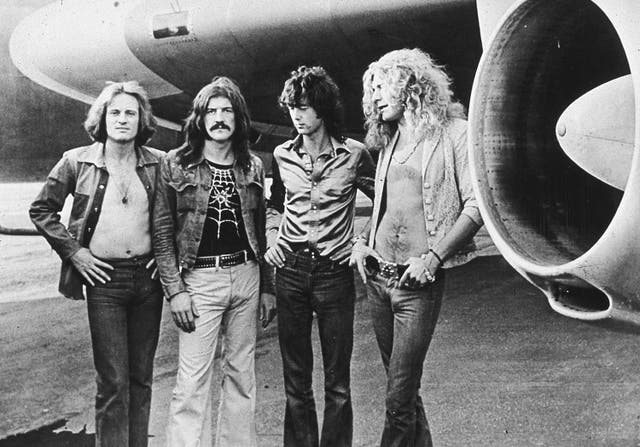
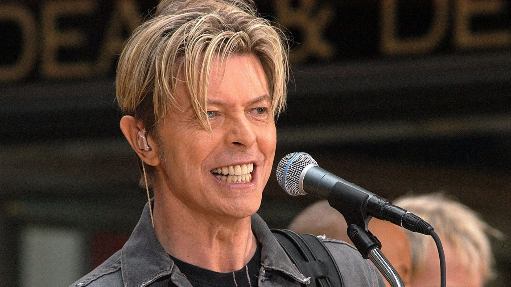
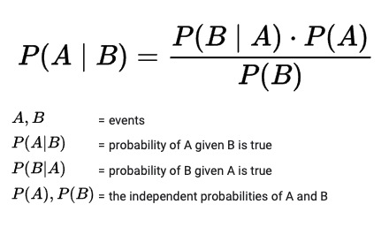

    
    

# "Anything British"

When asked what type of music I enjoy, I typically respond, "anything British." I am not an English native, have not spent any significant amount of time in the UK, nor do I have any other rational or emotional justification to prefer any aspect of the culture. However, my personal experience suggests the distribution of phenomenal musicians is heavily skewed British. From classic like the Beatles, the Rolling Stones, Led Zeppelin, and Pink Floyd to modern virtuosos like Muse, Coldplay, and Adele, the country of 60M people's trade surplus of rhythm is seemingly unmatched.

As an objectivist, I am also acutely aware that many biases could be skewing my observations, to name a few:

1. **Genre -** The aforementioned British artist are mostly rock & roll; the trend may be localized to this genre.
2. **Language -** As an American, it's more likely I'd listen to music in my native language of english.
3. **Distribution -** Historically strong trading relations between the US and England may have attributed to a greater awareness of British music.
4. **Stylistic -** My musical preferences happen to skew British, and I've developed a bias through reinforcing this proclivity. 

The genesis for this project was twofold: to test a hypothesis about British musical talent and to learn more about the GCP Custom Search Engine microservice.

### I. Business Problem: 

Data Science is fundamentally about finding signals in the noise. Those signals are the statistically significant patterns that characterize the dataset. If the data are representative, the hope is to create & apply knowledge from the observed systemic relationships to make generalized predictions and improvements. Less formally, we can use data science techniques to get at the general thrust of phenomena - which I submit is a proxy for truth. 

Although this project was not designed to solve a specific business problem, the concepts can be applied to a spectrum of investment decisions where understanding a market segment is critical for success. For example, a thesis tailored for the music industry:

>***If launching a new record label, is it possible to mitigate risk by focusing in certain geographic regions, i.e. - do some countries have an ecosystem, educational infrastructure, or audio-centric culture that inspires and develops musicians better than others?***
>

    
**The Art of Data Science -**

The first major question is how to quantify a subjective concept of "best" in the realm of art. It's tempting to use mathematically convenient numbers from record sales volume, touring revenue, and streams, but these do not account for relative population sizes, marketing budges, native languages, and Spotify market penetration. 

**Experiment Design -**

My answer was approached by the following thought experiment: if **Country X** exhibited a tendency towards producing better musicians, then we would observe a correspondingly higher likelihood of listeners from around the globe outside **Country X** streaming its music. This concept mathematically translates to Bayes' Theorem, and his powerful idea is the tool of choice for cutting through statistical noise. 

------

    
    

### Modeling -

Differences notwithstanding, we can all agree on Mozart. This postulate motivates a ***Universal Appeal*** approach to the complex question of which country produces the "greatest" musicians. 

*Universal Appeal* is a metric I've created which assumes the best music transcends borders, connects with listeners more profoundly, and results in a higher relative stream frequency and likelihood of being shared.

The idea for Universal Appeal was driven by the need to simplify, i.e., control for the litany of variables that contribute or diminish a musician's popularity, such as native langauge, country population size, Spotify's relative market penetration, jingoistic tendencies, et cetera. 

Mathematically, Universal Appeal uses a probabilitistic model to represent all variance, theoretically cancelling the aforementioned statistical noise. Conceptually, given the population of all Spotify streams, if `Country X` consistently produces the "best" musicians, then the aggregate likelihood of a listener streaming a `Country X` artist from anywhere in the world will be higher.

Cast in Bayesian terms, the probability of artist, given country, is the probability of country, given artist multiplied by the probability of artist, divided by probability of country to normalize the result:

***\>> P(stream of artist from nation X | listener in country Y) = P(listener in country Y | stream of artist from nation X) * P(stream of artist from nation X) / P(listener in country Y)***

### Analysis & Visualization -

* With the \#1 position in 54 of the 62 countries, the US was by far the global preference for artist origin from 2017-01-01 to 2019-07-01 according to this dataset.

* British and Columbians are second favorites across 24 and 15 countries, respectively.

* A strong preferences exists for local artists.

<a href='https://public.tableau.com/app/profile/russell.w.myers/viz/WhatsintheWater/Dashboard1'> >> Link to Tableau dashboard for this project</a>
